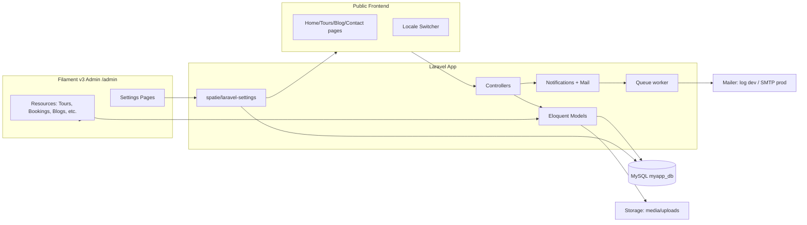
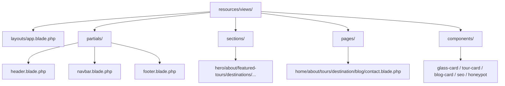

# Tourism Starter Kit — Implementation Plan

## Comparison & Recommendations

Two plan candidates were generated and consolidated. Both agreed on overall stack, 9-phase sequencing, and core schema. The differences and how this final plan resolves them:

| Area | Plan A (detailed) | Plan B (lean) | **Adopted** |
|---|---|---|---|
| File detail | Exhaustive file-by-file | Directory-level | **Plan A** — execution clarity |
| Schema extras (`is_featured`, `order`, `booking_number`, `gallery_items` table, `languages` table) | Included | Omitted | **Plan A** — needed for ordering/filtering UX |
| SEO meta columns | Separate `meta_title` + `meta_description` (JSON) | Single `seo_meta` JSON | **Plan A** — easier per-field Filament editing |
| Booking model | `booking_number`, `special_requests`, `admin_notes` | `user_id` (nullable), `payment_status`, `transaction_id` | **Hybrid** — take all (Plan A fields + nullable `user_id` + payment columns reserved for future) |
| Email pattern | Laravel Notifications (`ShouldQueue`) | Mailables | **Notifications** — multi-channel ready, plus auto-reply to contact submitter |
| Roles management | Manual Policies (12 files) | `bezhansalleh/filament-shield` | **filament-shield** — auto-generates policies/permissions from Filament resources, much faster |
| Search | LIKE across tours/blogs/destinations w/ tabs | Not specified | **Plan A** |
| Settings classes | 5 (`General`, `Theme`, `Seo`, `Mail`, `Language`) | 3 | **5 classes** |
| Future expansion | `App\Modules\{Name}\` namespaced | `Modules/` top-level | **`App\Modules\`** + reserve `payment_status`/`transaction_id` columns now |
| Risks | 5 risks documented | 2 | **5 risks** |

---

## 1. Objective

A reusable Laravel 12 Tourism Management Starter Kit with Filament v3 admin, Glassmorphism UI, multilingual content (6 languages incl. Arabic RTL), role-based access, and settings-driven theming/branding so future client projects only require content + theme changes.

## 2. Locked Tech Decisions

- Laravel 12 (PHP 8.2+), MySQL `myapp_db`
- Filament v3 admin at `/admin` with `filament-shield` for RBAC
- Auth: Laravel Breeze (Blade)
- Translatable models: `spatie/laravel-translatable` (JSON columns)
- UI strings: Laravel `lang/<locale>.json`
- Roles: `spatie/laravel-permission` + `bezhansalleh/filament-shield`
- Media: `spatie/laravel-medialibrary` + Intervention Image v3
- Settings: `spatie/laravel-settings` (5 typed setting classes)
- Slugs: `cviebrock/eloquent-sluggable`
- Filament locale tabs: `filament/spatie-laravel-translatable-plugin`
- Frontend: Tailwind v4 (CSS-first config) + Alpine.js + Blade components
- Mail dev driver = `log`; queue = `database`

## 3. Architecture



```mermaid
sequenceDiagram
    actor User
    participant FE as Tour Detail Page
    participant BC as BookingController
    participant DB as MySQL
    participant Q as Queue (database)
    participant MAIL as Mailer (log)

    User->>FE: Fill booking form (date, travelers)
    FE->>BC: POST /bookings
    BC->>BC: Validate + honeypot + rate-limit
    BC->>DB: Insert booking (BK-xxxxxx)
    BC->>Q: Dispatch BookingConfirmation (customer)
    BC->>Q: Dispatch NewBookingAdmin (admin)
    Q->>MAIL: Send queued mails
    BC-->>User: Success page / flash
    Note over DB,MAIL: Admin sees booking in /admin/bookings; both mails appear in storage/logs/laravel.log
```



## 4. Database Schema (final)

| Table | Key Columns | Notes |
|---|---|---|
| `users` | id, name, email, password, timestamps | `HasRoles` trait |
| `roles`, `permissions`, `model_has_*` | (spatie/laravel-permission migrations) | |
| `settings` | group, name, locked, payload | spatie/laravel-settings |
| `media` | (medialibrary default) | polymorphic |
| `languages` | code (PK-like), name, native_name, is_active, is_rtl, `order` | seeded en/fr/de/es/ar/sw |
| `tour_categories` | id, **name JSON**, slug, **description JSON**, image, is_active, `order`, ts | translatable |
| `destinations` | id, **name JSON**, slug, **short_description JSON**, **description JSON**, country, **meta_title JSON**, **meta_description JSON**, is_featured, is_active, `order`, ts | translatable |
| `tours` | id, destination_id (FK), tour_category_id (FK), **name JSON**, slug, duration_days, duration_nights, price, discount_price, **description JSON**, **itinerary JSON**, **included JSON**, **excluded JSON**, **meta_title JSON**, **meta_description JSON**, status, is_featured, `order`, ts | translatable |
| `blog_categories` | id, **name JSON**, slug, is_active, ts | |
| `blog_posts` | id, blog_category_id (FK), user_id (FK), **title JSON**, slug, **excerpt JSON**, **body JSON**, **meta_title JSON**, **meta_description JSON**, status, is_featured, published_at, ts | |
| `bookings` | id, booking_number (unique `BK-xxxxxx`), tour_id (FK), user_id (nullable FK), customer_name, customer_email, customer_phone, booking_date, travelers_count, total_price, special_requests, admin_notes, status, **payment_status (reserved)**, **transaction_id (reserved)**, ts | |
| `contact_messages` | id, name, email, phone, subject, message, is_read, admin_notes, ts | |
| `testimonials` | id, client_name, client_title, location, **body JSON**, rating, is_active, `order`, ts | |
| `faqs` | id, **question JSON**, **answer JSON**, is_active, `order`, ts | |
| `newsletter_subscribers` | id, email (unique), is_active, ts | |
| `home_sections` | id, section_key (unique), **title JSON**, **subtitle JSON**, enabled, `order`, background_image, ts | seeded fixed rows; edit-only in Filament |
| `pages` | id, **title JSON**, slug, **body JSON**, **meta_title JSON**, **meta_description JSON**, is_active, ts | for About / Privacy / Terms / FAQ static page |
| `gallery_items` | id, **title JSON**, **description JSON**, category, `order`, is_active, ts | media via medialibrary |

All `JSON` columns hold per-locale strings: `{"en": "...", "fr": "...", "ar": "..."}`.

---

## 5. Phased Plan

### Phase 0 — Foundations

**Goal:** Project skeleton, packages, base Blade layout, theme tokens, locale middleware, Filament panel scaffolded.

**Composer installs:** `laravel/breeze` (--dev), `filament/filament:^3`, `spatie/laravel-translatable`, `spatie/laravel-permission`, `spatie/laravel-medialibrary`, `spatie/laravel-settings`, `cviebrock/eloquent-sluggable`, `filament/spatie-laravel-translatable-plugin`, `bezhansalleh/filament-shield`.

**NPM installs:** `alpinejs`.

**Files to create / modify:**
- `C:\xampp\htdocs\myapp\config\tourism.php` — `supported_locales`, `rtl_locales`, fixed `home_sections` keys.
- `C:\xampp\htdocs\myapp\app\Http\Middleware\SetLocale.php` — read `{locale}` route param, set `App::setLocale`, fallback to `APP_LOCALE`.
- `C:\xampp\htdocs\myapp\bootstrap\app.php` — register `SetLocale` middleware alias.
- `C:\xampp\htdocs\myapp\routes\web.php` — `/` redirects to `/{default_locale}`; group all public routes under `Route::prefix('{locale}')->middleware('setlocale')`.
- `C:\xampp\htdocs\myapp\resources\css\app.css` — `@theme` with CSS vars (`--color-primary`, `--color-accent`, `--color-bg`, glassmorphism utilities `.glass-card`, `.glass-nav`, `.gradient-bg`).
- `C:\xampp\htdocs\myapp\resources\js\app.js` — register Alpine.
- `C:\xampp\htdocs\myapp\resources\views\layouts\app.blade.php` — `<html lang dir>`, theme CSS vars block, slots for header/footer, AI chatbot placeholder comment.
- `C:\xampp\htdocs\myapp\resources\views\partials\{header,navbar,footer}.blade.php` — placeholder structure.
- `C:\xampp\htdocs\myapp\resources\views\sections\{hero,about,featured-tours,destinations,testimonials,statistics,blogs,faq,gallery,newsletter,contact}.blade.php` — placeholders.
- `C:\xampp\htdocs\myapp\resources\views\pages\{home,about,tours,destination,blog,contact}.blade.php` — placeholders pulling sections via `@include`.
- `C:\xampp\htdocs\myapp\resources\views\components\{glass-card,tour-card,blog-card,destination-card,seo,honeypot}.blade.php`.
- `C:\xampp\htdocs\myapp\app\Providers\Filament\AdminPanelProvider.php` (auto-created by `filament:install --panels=admin`).
- Run Breeze install (Blade stack); keep public auth routes minimal.
- `php artisan vendor:publish` for permission, medialibrary, settings, translatable.
- `php artisan migrate` (creates auth, jobs, sessions, cache, perm, media, settings tables).
- `.pint.json` — Laravel preset.

**Routes (public):**
- `GET /` → redirect to `/{default}`
- `GET /{locale}` → `HomeController@index` (name: `home`)
- `GET /{locale}/tours` → `TourController@index` (name: `tours.index`)
- `GET /{locale}/tours/{tour:slug}` → `TourController@show` (name: `tours.show`)
- `GET /{locale}/destinations[/{slug}]` (`destinations.index|show`)
- `GET /{locale}/blog[/{slug}]` (`blog.index|show`)
- `GET /{locale}/about|/contact|/gallery|/faq|/privacy|/terms`
- `POST /{locale}/contact` (`contact.store`, throttled)
- `POST /{locale}/bookings` (`bookings.store`, throttled)
- `POST /{locale}/newsletter/subscribe`
- `GET /{locale}/search`
- `GET /lang/{code}` — locale switch (sets cookie, redirects back)

**DoD:** `php artisan migrate:fresh` clean; Breeze login works; `/admin` reachable (empty); `/en` returns layout with placeholder header/footer; switching `--locale=ar--` flips `dir="rtl"`.

---

### Phase 1 — Settings & Theming

**Goal:** Settings-driven branding, theme, SEO defaults, mail config, language list.

**Files:**
- `app/Settings/GeneralSettings.php` — site_name, tagline, logo, favicon, contact_email, contact_phone, address, social_links[].
- `app/Settings/ThemeSettings.php` — primary_color, accent_color, bg_color, font_family, hero_overlay_opacity.
- `app/Settings/SeoSettings.php` — default_meta_title, default_meta_description, og_image, twitter_handle.
- `app/Settings/MailSettings.php` — admin_notification_email, from_address, from_name, reply_to.
- `app/Settings/LanguageSettings.php` — default_locale, enabled_locales[].
- 5 migration files under `database/settings/` (settings tool format).
- 5 Filament Settings pages under `app/Filament/Pages/Settings/` (icon, navigation_group="Settings").
- `app/View/Composers/ThemeComposer.php` — binds `ThemeSettings` to layout, emits inline `<style>` with CSS vars.
- `app/Providers/AppServiceProvider.php` — register composer for `layouts.app`.
- `database/seeders/SettingsSeeder.php` — sensible defaults.

**DoD:** Edit theme color in `/admin/settings/theme` → public site reflects new color on next request. Logo upload renders in header.

---

### Phase 2 — Tours, Categories, Destinations

**Goal:** Core tourism content models live; public listing + detail pages render seeded data.

**Migrations (per schema table above):** `tour_categories`, `destinations`, `tours`.

**Models:**
- `app/Models/TourCategory.php` — `HasTranslations`, `Sluggable`, `HasMedia`.
- `app/Models/Destination.php` — same + media collection `gallery`.
- `app/Models/Tour.php` — `HasTranslations`, `Sluggable`, `HasMedia` (collections: `featured`, `gallery`); relations: `belongsTo` Destination, TourCategory; scopes `active`, `featured`.

**Controllers:** `App\Http\Controllers\TourController`, `DestinationController` (index/show with locale-aware queries).

**Filament resources:** `app/Filament/Resources/{TourResource,TourCategoryResource,DestinationResource}.php` with locale tabs (translatable plugin). Tables: image thumb, name, status, featured toggle, price (Tour), filters (status, category, destination, featured).

**Blade:** `sections/featured-tours.blade.php`, `sections/destinations.blade.php`, `pages/tours.blade.php`, `pages/destination.blade.php`, `pages/tour-show.blade.php` using glass-card / tour-card components. SEO via `<x-seo />`.

**Seeders:** `TourCategorySeeder` (Adventure, Cultural, Beach, Wildlife, City, Honeymoon), `DestinationSeeder` (5–8 demo), `TourSeeder` (12+ demo with translations en/fr/ar).

**DoD:** `/en/tours` lists 12 tours; clicking a tour shows itinerary, gallery, included/excluded; SEO meta in `<head>`; admin can edit tour and translate fields.

---

### Phase 3 — Blog

**Goal:** Blog listing, detail, categories, rich-text body.

**Migrations:** `blog_categories`, `blog_posts`.

**Models:** `BlogCategory`, `BlogPost` (HasTranslations, Sluggable, HasMedia, relation to user as author).

**Controllers:** `BlogController@index|show`.

**Filament resources:** `BlogPostResource` (rich editor for `body`, locale tabs, status, featured, published_at, category select), `BlogCategoryResource`.

**Blade:** `sections/blogs.blade.php`, `pages/blog.blade.php`, `pages/blog-show.blade.php`.

**Seeders:** 4 categories + 8 posts.

**DoD:** `/en/blog` lists posts; `/admin/blog-posts` create/edit with tabs; published filter respected.

---

### Phase 4 — Booking & Contact

**Goal:** Persist + email both flows.

**Migrations:** `bookings`, `contact_messages`.

**Models:** `Booking` (auto-generate `booking_number` in `creating` event: `BK-` + Y+m+d + random 4); `ContactMessage`.

**Controllers:**
- `BookingController@store` — validate (date≥today, travelers≥1, max≤tour limit), honeypot, rate-limit (3/min/IP), compute `total_price = travelers * (discount_price ?? price)`, dispatch notifications.
- `ContactController@store` — validate, honeypot, rate-limit, dispatch notifications.

**Notifications (queued):**
- `App\Notifications\BookingConfirmation` (to customer, mail channel)
- `App\Notifications\NewBookingAdmin` (to admin from MailSettings)
- `App\Notifications\ContactFormSubmitted` (to admin)
- `App\Notifications\ContactFormAutoReply` (to submitter)

**Mail templates:** `resources/views/mail/{booking-confirmation,new-booking,contact-submitted,contact-auto-reply}.blade.php` styled with brand vars.

**Blade:** booking form embedded in `pages/tour-show.blade.php` (Alpine date+travelers picker); `pages/contact.blade.php` form.

**Filament:** `BookingResource` (table: number, customer, tour, date, travelers, total, status filter; bulk actions: mark confirmed/cancelled). `ContactMessageResource` (mark-read action). Both listed in nav group "Communications".

**Dashboard widgets:** `app/Filament/Widgets/{StatsOverview,LatestBookings,LatestMessages}.php`.

**DoD:** Submit booking → row in `bookings`, 2 entries in `storage/logs/laravel.log` (admin + customer). Same for contact. Dashboard widgets show counts.

---

### Phase 5 — Supporting Modules

**Goal:** Testimonials, FAQ, Gallery, Newsletter, Home Sections, Static Pages.

**Migrations:** `testimonials`, `faqs`, `gallery_items`, `newsletter_subscribers`, `home_sections`, `pages`.

**Models + Resources:** one Filament resource each.
- `HomeSectionResource` — disable create/delete; pre-seeded rows for fixed section keys (hero, featured_tours, destinations, why_us, statistics, testimonials, categories, gallery, latest_blog, newsletter, contact, faq); table has reorder + toggle columns.

**Controllers:**
- `HomeController@index` — eager-load enabled `home_sections` ordered, plus featured tours/destinations/blogs/testimonials/FAQs/gallery; pass to `pages.home` which loops sections and `@includes` the matching `sections/*.blade.php` partial.
- `NewsletterController@subscribe`, `PageController@show` (slug → static page), `GalleryController@index`, `FaqController@index`.

**Seeders:** `HomeSectionSeeder` (12 fixed rows), `TestimonialSeeder` (5), `FaqSeeder` (8), `GallerySeeder` (12 images), `PageSeeder` (About, Privacy, Terms).

**DoD:** Toggling a section in admin instantly hides it on `/en`. Reordering changes display order. All static pages reachable.

---

### Phase 6 — Multilingual

**Goal:** Full UI translation + 6 locales + RTL.

**Files:**
- `lang/en.json` — ~200 keys (nav, buttons, form labels, validation overrides, section titles).
- `lang/fr.json`, `de.json`, `es.json`, `ar.json`, `sw.json` — stubs with ~20 essential keys; rest fallback to English.
- `database/seeders/LanguageSeeder.php` — 6 rows in `languages`.
- `resources/views/partials/language-switcher.blade.php` — dropdown listing active languages with flags; uses `route('lang.switch', $code)`.
- `app/Http/Controllers/LocaleController@switch` — validates locale ∈ enabled_locales; redirects with locale prefix swapped.
- `resources/css/app.css` — `[dir="rtl"]` overrides for glass cards, nav alignment, gradients.

**Filament:** locale tabs already on translatable resources via plugin. Admin labels translated via `lang/<locale>.json` keys read by `__()`.

**DoD:** Switching to Arabic → `<html dir="rtl">`, layout mirrors, Arabic strings render. Adding a new locale row in `languages` + a JSON file under `lang/` makes it appear in switcher with no code change.

---

### Phase 7 — Roles & Permissions

**Goal:** 4 roles enforced everywhere.

**Files:**
- Install/configure `bezhansalleh/filament-shield`; run `php artisan shield:install admin` and `php artisan shield:generate --all`.
- `database/seeders/RolesAndPermissionsSeeder.php` — create roles `super_admin`, `admin`, `editor`, `content_manager`; assign permissions per matrix:
  - super_admin: all
  - admin: all except settings.* and user/role management
  - editor: tours.*, blogs.*, destinations.*, gallery.*, testimonials.*, pages.*, faqs.* (CRUD + publish); read-only on bookings/messages
  - content_manager: same as editor minus delete & publish
- `app/Models/User.php` — add `HasRoles`, `canAccessPanel()` checks role ∈ {super_admin, admin, editor, content_manager}.
- `app/Filament/Resources/{UserResource,RoleResource}.php`.
- `database/seeders/AdminUserSeeder.php` — `admin@example.com` / password `password`, role super_admin.
- `DatabaseSeeder.php` — orchestrate all seeders into `DemoContentSeeder`.

**DoD:** Editor login cannot see Settings nav group; cannot delete tours; super_admin sees everything. `php artisan migrate:fresh --seed` produces a fully populated demo site.

---

### Phase 8 — Polish & Hardening

**Goal:** Glassmorphism quality pass, search, security, tests, README.

**Files / tasks:**
- Re-style every section to spec (frosted cards, gradients, full-width hero with bg image from `home_sections.background_image`, soft shadows).
- `resources/views/errors/404.blade.php` — branded.
- `pages/search.blade.php` + `App\Http\Controllers\SearchController` — LIKE across tour name/desc, blog title/body, destination name/desc; tabbed results.
- `routes/web.php` — apply `throttle:contact`, `throttle:booking`, `throttle:newsletter` (defined in `AppServiceProvider::boot()` via `RateLimiter::for(...)`).
- Honeypot field on every public POST form via `<x-honeypot />`.
- File upload validation in Filament resources (max 5 MB images, mime check).
- `config/medialibrary.php` — image conversions: `thumb` 300x200, `medium` 800x600, `large` 1600x1000.
- `tests/Feature/{HomePageTest,TourListingTest,TourDetailTest,BookingTest,ContactTest,AdminLoginTest,LocaleSwitchTest}.php`.
- `README.md` rewrite — install, seed, queue worker (`php artisan queue:work`), Supervisor sample for prod, customization guide (theme colors, logo, sections, languages).
- Run `php artisan pint`, `php artisan test`.

**DoD:** All feature tests green; Pint clean; manual click-through of every page in en + ar; rate-limit returns 429; honeypot blocks bot submissions.

---

## 6. Future-Expansion Architecture (no code, MVP)

- New modules under `app/Modules/{Hotel,Flight,CarRental,Payment,Affiliate}/` each with its own ServiceProvider, migrations, routes (`routes/{module}.php`), Filament plugin, contracts in `app/Contracts/`.
- `App\Contracts\PaymentGatewayInterface` (charge / refund / verify) — drivers Stripe/PayPal/Local.
- API: `routes/api.php` with Sanctum scaffolded later for mobile.
- Pre-reserved `bookings.payment_status` + `transaction_id` columns are populated when Payment module is enabled.

## 7. Risks & Mitigations

1. **Translatable JSON + LIKE search slow at scale** — mitigate by adding generated columns + indexes, or upgrade to Laravel Scout post-MVP.
2. **Filament v3 + spatie translatable plugin version drift** — pin minor versions in `composer.json`; test after each upgrade.
3. **RTL breaks custom glassmorphism utilities** — dedicate `[dir="rtl"]` overrides; manual QA pass for Arabic in Phase 6.
4. **Medialibrary disk bloat (3 conversions × N uploads)** — cap upload size, schedule `medialibrary:clean`, document storage symlink.
5. **Queue worker not running in dev = silent email failures** — README mentions `QUEUE_CONNECTION=sync` toggle for local; Supervisor config sample for prod.

## 8. Explicit Non-Goals (MVP)

- AI Chatbot widget (layout slot only, commented placeholder)
- Audit logs
- XML Sitemap
- Schema.org structured data
- Payment gateway integration (columns reserved, no logic)
- Hotel / Flight / Car Rental booking
- Mobile API endpoints
- Laravel Scout / full-text search

## 9. Traceability — Roadmap → Phase → Verification

| Roadmap requirement | Phase | Verification |
|---|---|---|
| Glassmorphism UI, layouts/partials/sections folders | 0, 8 | All listed files exist; manual visual check |
| Multilingual (6 langs, RTL, switcher, no-code-change new lang) | 6 | Switcher works; adding `sw.json` + row appears |
| Tour management (all listed fields) | 2 | Filament TourResource form has every field |
| Booking → DB + email admin + email customer | 4 | DB row + 2 log entries per submission |
| Contact form → DB + admin email | 4 | DB row + log entry; auto-reply log entry |
| Blog CRUD + categories + rich editor + SEO | 3 | BlogPostResource green-field test |
| Admin Panel (all listed sections) | 0–7 | Each Filament resource present |
| Roles (4 roles) | 7 | Editor cannot access Settings (manual + test) |
| Media management + image optimization | 0, 2, 3, 5 | Conversions generated on upload |
| SEO meta + OG + Twitter + slugs + canonical | 0, 2, 3 | View source on tour/blog detail |
| Settings-driven theming/branding | 1 | Color change in admin reflected publicly |
| Home sections enable/disable + reorder | 5 | Toggle hides section live |
| Security: CSRF, validation, rate limit, honeypot, secure uploads | 0, 4, 8 | 429 on flood; honeypot blocks; mime rejected |
| Future expansion ready | 9 (doc) | README architecture section |

## 10. Definition of Done (overall)

- `php artisan migrate:fresh --seed` runs cleanly on `myapp_db`.
- `/admin` login as `admin@example.com` / `password` → all resources visible.
- `/en` renders all 12 home sections with seeded content.
- `/ar` renders RTL with translated strings.
- Booking + contact submission produce DB rows + queued mail entries in `storage/logs/laravel.log`.
- `php artisan pint` clean; `php artisan test` green.
- README documents setup, queue worker, customization (colors/logo/sections/languages), and post-MVP roadmap.
